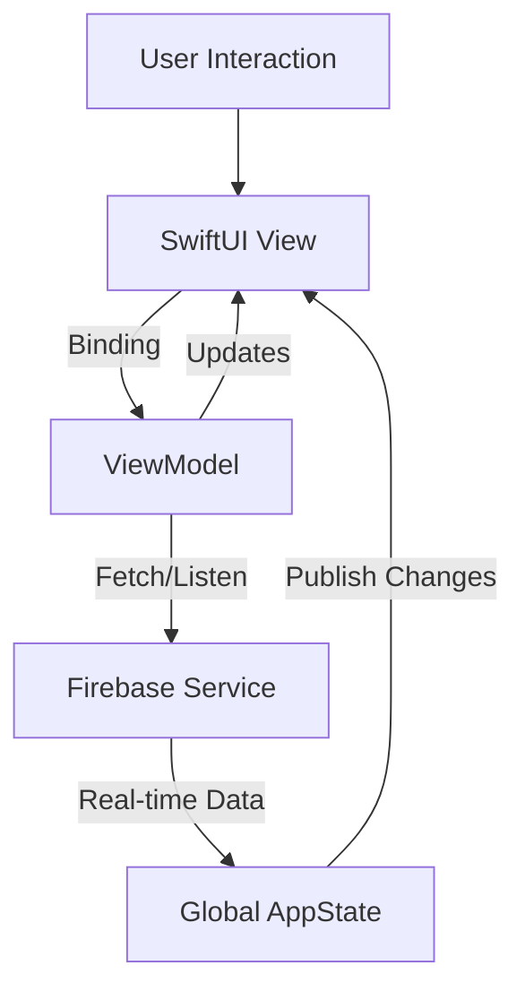

# 🚀 QueueApp (SWU Queue & Space)


> **"Smart Queue & Learning Space Management Solution"**
>
> แพลตฟอร์มบริหารจัดการพื้นที่การเรียนรู้และระบบคิวอัจฉริยะภายในมหาวิทยาลัย ที่ช่วยให้นิสิตเข้าถึงบริการต่างๆ ได้อย่างสะดวก รวดเร็ว และ Real-time!

---

## 🌟 Features (ฟีเจอร์หลัก)

แอปพลิเคชันถูกออกแบบมาเพื่อแก้ปัญหาความแออัดและการจองพื้นที่ โดยแบ่งฟีเจอร์ตามกลุ่มผู้ใช้งาน:

### 👨‍🎓 For Students (สำหรับนิสิต)
*   **🔐 Authentication:** ระบบยืนยันตัวตนแยก Role (Student/Guest) ปลอดภัยและเป็นส่วนตัว
*   **📅 Smart Booking System:** จองพื้นที่และอุปกรณ์ได้ง่ายๆ พร้อมเช็คสถานะ Real-time
    *   🎲 **Board Game:** จองโต๊ะและเลือกเกมที่อยากเล่น
    *   💻 **Co-Working Space:** เลือกที่นั่งได้เอง (Seat Selection)
    *   🎬 **Netflix Room:** จองห้องดูหนังส่วนตัว
    *   📸 **Green Screen Studio:** จองห้องถ่ายทำพร้อมอุปกรณ์
*   **⏳ Live Queue:** กดรับบัตรคิวออนไลน์และดูจำนวนคิวที่รอได้ทันที
*   **💬 SWU Social:** พื้นที่คอมมูนิตี้ พูดคุย แลกเปลี่ยน (รองรับ Anonymous Post)
*   **🗺️ Campus Map:** แผนที่แสดงจุดสำคัญภายในมหาวิทยาลัย

### 👮 For Admins (สำหรับผู้ดูแล)
*   **📊 Dashboard:** ดูภาพรวมสถิติการใช้งาน
*   **✅ Booking Management:** จัดการรายการจอง Check-in/Check-out
*   **📢 Queue Control:** สร้างกิจกรรม เรียกคิว และจัดการแถว
*   **🛡️ Content Moderation:** ดูแลความเรียบร้อยใน Social Board

---

## 🛠 Tech Stack (เทคโนโลยีที่ใช้)

โปรเจคนี้พัฒนาด้วยเทคโนโลยีที่ทันสมัย เพื่อประสิทธิภาพสูงสุด:

*   **Language:** [Swift 5](https://developer.apple.com/swift/)
*   **UI Framework:** [SwiftUI](https://developer.apple.com/xcode/swiftui/) (100% Declarative UI)
*   **Architecture:** **MVVM** (Model-View-ViewModel)
*   **Backend & Database:** [Firebase](https://firebase.google.com/)
    *   **Authentication:** Manage Users & Roles
    *   **Cloud Firestore:** NoSQL Database with **Real-time Listeners**
*   **State Management:** `ObservableObject`, `@Published`, `@EnvironmentObject` (Single Source of Truth with `AppState`)

---

## 🏗 Architecture Highlights

เราใช้สถาปัตยกรรม **MVVM** ผสานกับ **Global AppState** เพื่อการจัดการข้อมูลที่ลื่นไหล:



*   **Real-time Updates:** ใช้ Firestore Snapshot Listeners เพื่ออัปเดตหน้าจอทันทีที่มีการเปลี่ยนแปลง (เช่น สถานะโต๊ะเปลี่ยนเป็นสีเทาทันทีเมื่อมีคนจอง)
*   **Optimistic UI:** ตอบสนองการกระทำของผู้ใช้ทันทีเพื่อให้รู้สึกว่าแอปเร็วขึ้น
*   **Race Condition Handling:** ใช้ `Firebase Transactions` และ `FieldValue.arrayUnion` เพื่อป้องกันข้อมูลชนกัน

---

## 📂 Project Structure

โครงสร้างไฟล์จัดระเบียบตามหน้าที่ (Separation of Concerns):

```
QueueApp_project/
├── 📱 QueueApp_projectApp.swift  // Entry Point & App Configuration
├── 🎨 View/                      // UI Components (SwiftUI)
│   ├── Auth/                     // Login, Register
│   ├── Booking/                  // Booking Flows (BoardGame, Co-Working, etc.)
│   ├── Social/                   // Social Board & Posts
│   ├── Admin/                    // Admin Dashboard Tools
│   └── ...
├── 🧠 ViewModel/                 // Business Logic & State Transformation
├── 📦 Model/                     // Data Models (User, Booking, Activity)
├── 🔌 Service/                   // Firebase Integration & API Calls
├── ⚙️ Utils/                     // Helpers (AppState, TimeFormatter)
└── 🖌️ Style/                     // Design System (Colors, Fonts, Components)
```

---

## 🚀 Getting Started

1.  **Clone the repository**
    ```bash
    git clone https://github.com/yourusername/QueueApp_project.git
    ```
2.  **Open in Xcode**
    *   Double click `QueueApp_project.xcodeproj` (or `.xcworkspace`)
3.  **Install Dependencies**
    *   Wait for Swift Package Manager (SPM) to resolve packages automatically.
4.  **Setup Firebase**
    *   Ensure `GoogleService-Info.plist` is placed in the `QueueApp_project/Resources` folder.
5.  **Run the App**
    *   Select your simulator and press `Cmd + R`.

---

## 📸 Screenshots

| Home Dashboard | Booking System | Social Board |
|:---:|:---:|:---:|
| <!-- ใส่รูปตรงนี้ -->  | <!-- ใส่รูปตรงนี้ -->  | <!-- ใส่รูปตรงนี้ -->  |

---

## 👨‍💻 Developed By

*   **Thanap** - *Lead Developer*

---
*Made with ❤️ for SWU Students*
